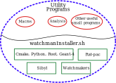

Watchman Utilities
==================
**Maintainer:** [@MorganAskins](https://github.com/MorganAskins)
<div align="center"></div>

This repository is an organized dumping ground for watchman related code which
should include useful tools (such as watchmakers and sibyl), related analysis
scripts, macro files, and anything else that does not belong directly in
rat-pac.

watchmanInstaller.sh
--------------------
The watchman installer script is designed to help with the installation of
various components of the watchman software suite. It is not designed to
be completely fool-proof or work on every system. Compatibility seems to
be best with various newer versions of linux. Each piece of the package
can either be installed separately or all together; for a first time through
I would recommend installing and testing each piece in order.

To run:
```bash
./watchmanInstaller.sh
```

To skip individual components, or target specific components use
```bash
./watchmanInstaller.sh --skip $X
## OR
./watchmanInstaller.sh --only $X

── $X ∈ (cmake, python, root, geant, ratpac, sibyl)
```

The installer will check if particular libraries are already available on
the system before running. If they are not it is recommended to go install
them through your system's package manager. If the check fails but you want
to attempt to install everything anyways, then you can skip the checks
```bash
./watchmanInstaller.sh --skip-checks
```

Finally, multi-thread the compilation, you can pass through the number of
processors for cmake to use
```bash
./watchmanInstaller.sh -jN
```

Once complete, everything should be installed locally and a file `env.sh`
will be created---source this to setup the working environment.
